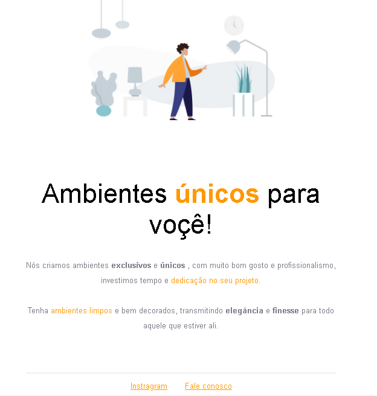

  <a href="#-tecnologias">Tecnologias</a>&nbsp;&nbsp;&nbsp;|&nbsp;&nbsp;&nbsp;
  <a href="#-projeto">Projeto</a>&nbsp;&nbsp;&nbsp;|&nbsp;&nbsp;&nbsp;
  <a href="#-layout">Layout</a>&nbsp;&nbsp;&nbsp;|&nbsp;&nbsp;&nbsp;

  

 

 
 

## 🚀Tecnologias

Esse projeto foi desenvolvido com as seguintes tecnologias:

- HTML
- CSS

Bibliotecas

- [Google Fonts](https://fonts.google.com/)
 
- font-family: 'Inter', sans-serif;
 
- font-family: 'Open Sans', sans-serif;
 

## 💻 Projeto
 

Móveis customizados é uma página institucional no formato One Page, com a finalidade do desafio Explorer administrado pela Rocketseat.
Contém as seguintes seções: div, id, h1, p, span, strong e br.
  

## 🔖 Layout
 

Você pode visualizar o layout do projeto através [desse link](https://www.figma.com/file/fAvYZz4dPV5MfhL77XkqkD/Explorer---Projeto-01?node-id=0%3A1). É necessário ter conta no [Figma](https://figma.com) para acessá-lo.
  

## 📝 Licença
 

Feito com ♥ by Rocketseat :wave: [Participe da nossa comunidade!](https://discordapp.com/invite/gCRAFhc).
